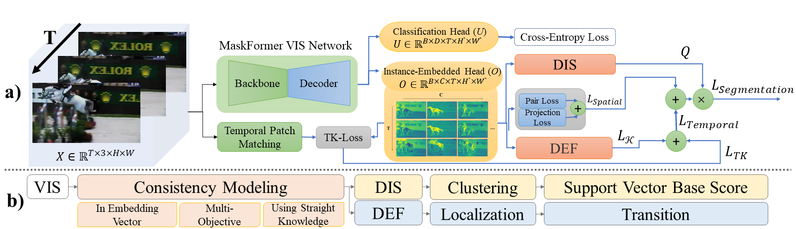
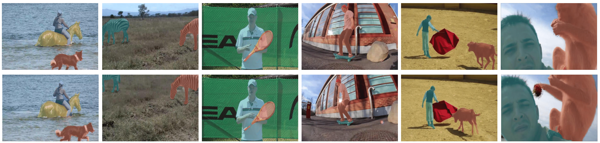

This repository contains the source code for ConsistVIS<br/>





To prepare and install and train for steps 1 and 2, you can use this [link](https://github.com/SysCV/MaskFreeVIS).
All the weights are in this [link](https://drive.google.com/drive/folders/14FyfzUCk7UE8jk_Y7cLJ6Ih2dO-Q7f4Z?usp=drive_link).

## Inference

```Shell
#R50
!CUDA_VISIBLE_DEVICES=0 python test.py --num-gpus 1 --resume --dist-url tcp://0.0.0.0:12349\
	--config-file configs/Step3/youtubevis_2019/video_maskformer2_R50_bs16_8ep.yaml\
        --eval-only MODEL.WEIGHTS /home/user01/MaskFreeVIS/Our_R101_498.pth
```

```Shell
#R101

!CUDA_VISIBLE_DEVICES=0 python test.py --num-gpus 1 --resume --dist-url tcp://0.0.0.0:12349\
	--config-file configs/Step3/youtubevis_2019/video_maskformer2_R101_bs16_8ep.yaml\
        --eval-only MODEL.WEIGHTS /home/user01/MaskFreeVIS/Our_R50_480.pth
```
```Shell
#SwinL

!CUDA_VISIBLE_DEVICES=0 python test.py --num-gpus 1 --resume --dist-url tcp://0.0.0.0:12349\
	--config-file configs/Step3/youtubevis_2019/swin/video_maskformer2_swin_large_IN21k_384_bs16_8ep.yaml\
        --eval-only MODEL.WEIGHTS /home/user01/MaskFreeVIS/Our_SwinL_567.pth
```

## Train
```Shell
#R50

! cp alpha_beta_r50.txt alpha_beta.txt && CUDA_VISIBLE_DEVICES=0 python3 train_net_video_r50_s3.py --num-gpus 1 --resume --dist-url tcp://0.0.0.0:12349\
	--config-file configs/Step3/youtubevis_2019/video_maskformer2_R50_bs16_8ep.yaml
```

```Shell
#R101


!cp alpha_beta_r101.txt alpha_beta.txt && CUDA_VISIBLE_DEVICES=0 python3 train_net_video_r101_s3.py --num-gpus 1 --resume --dist-url tcp://0.0.0.0:12349\
	--config-file configs/Step3/youtubevis_2019/video_maskformer2_R101_bs16_8ep.yaml 
```
```Shell
#SwinL


!cp alpha_beta_SwinL.txt alpha_beta.txt && CUDA_VISIBLE_DEVICES=0 python3 train_net_video_SwinL_s3.py --num-gpus 1 --resume --dist-url tcp://0.0.0.0:12349\
	--config-file configs/Step3/youtubevis_2019/swin/video_maskformer2_swin_large_IN21k_384_bs16_8ep.yaml 
```
            
### Acknowledgement
This codebase is heavily borrowed from [Mask-Free Video Instance Segmentation](https://github.com/SysCV/MaskFreeVIS). Thanks for their excellent work.
